<h1 align="center">Pal5 BeautifyRepair Mod</h1>
 
<p align="center">
  
    <br /><br />
    <a href="https://github.com/SaraKale/Pal5_BeautifyRepair_Mod/releases"></a>
    <a href=""></a>
    <a href=""></a>
</p>

<p align="center">
language：<a href="README_EN.md">English</a> | <a href="README_TC.md">繁體中文</a> 
</p>

> [Note] Currently still in **beta version**, there will still be issues such as crashes, blank icons, story not continuing, etc. Before playing the game, please try running the game as administrator by right-clicking on the Pal5.exe program.

## Introduction

This MOD is designed to enhance the gaming experience of "Chinese Paladin 5" (Sword and Fairy 5). It includes practical features such as UI interface resolution expansion, font modification, message dialog font size adjustment, body proportion adjustment, and hiding battle UI interface, providing a better experience for players who want to revisit the game. Hope it helps you!

Compatible with **steam/Wegame/Fangkuai** platforms. Currently, the game download is already in the uncompressed format. Whether it works on other platforms, please try it yourself.

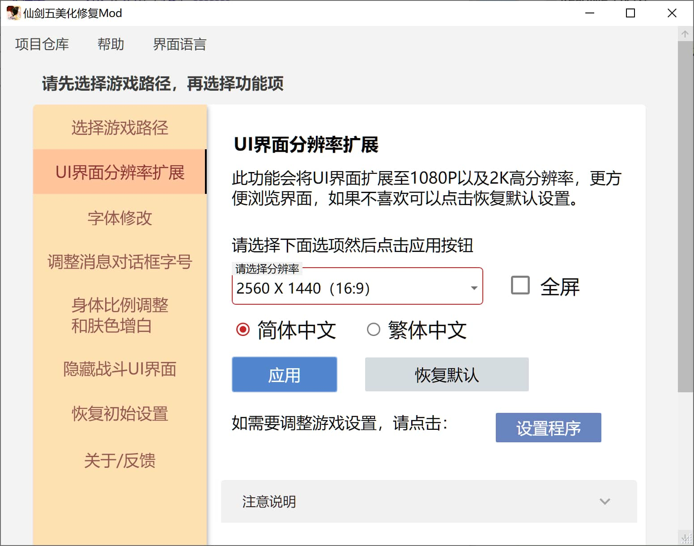

## Download

Please choose any of the following nodes to download.

|   Node    |                                 Link                                 | 
| :------: | :------------------------------------------: | 
|  Github  | [releases](https://github.com/sarakale/Pal5_BeautifyRepair_Mod/releases) |
|  Gitee   | [releases](https://gitee.com/sarakale/Pal5_BeautifyRepair_Mod/releases)  |
|  123 Pan  |         [Link](https://www.123865.com/s/xITljv-41WJH?pwd=PAL5#) Password:PAL5         |
|  Xunlei Cloud  |         [Link](https://pan.xunlei.com/s/VOklcmByg_M83Uzg_bgZ0noGA1?pwd=63dy#) Password:63dy         |
|  Baidu Netdisk |         [Link](https://pan.baidu.com/s/1tAwyLE711LKhhaz6fmgDnA?pwd=PAL5) Password:PAL5         |
|  mediafire |         [Link](https://www.mediafire.com/file/0wsi24e3apvc0z0/Pal5_BeautifyRepair_Mod_Beta_v0.0.1.zip/file)        |

## System Requirements

Operating system requirements: Windows 7 SP1 / 8 / 10 / 11

Must have Microsoft .NET Framework 4.8 runtime environment  
Download: https://dotnet.microsoft.com/en-us/download/dotnet-framework/net48

Since both Simplified and Traditional Chinese versions of Sword and Fairy 5 no longer support XP and Vista systems, the official requirement has changed to Win 7/8/10, but the Traditional Chinese version still supports Windows Vista.
Steam stopped supporting Win7/8/8.1 systems on January 1, 2024. After this date, the Steam client will not be able to run on the above versions of Windows systems. Other platforms are not affected, please upgrade your system according to the actual situation.

## Build

My development environment:  
System: Windows 10  
Environment: [Visual Studio 2022](https://visualstudio.microsoft.com/)  
Framework: .NET Framework 4.8  

Need to install Nuget packages:  
 - [MaterialDesignThemes](https://github.com/MaterialDesignInXAML/MaterialDesignInXamlToolkit)
 - [WPFLocalizeExtension](https://github.com/XAMLMarkupExtensions/WPFLocalizeExtension)

For more details, see `packages.config` package list installation.
Then directly run `Pal5Mod_BeautifyRepair.sln` to compile.

Or compile using other methods, for example **dotnet** compilation:
```
dotnet build Pal5Mod_BeautifyRepair.csproj --framework net48
```

## Usage

Double-click to run the `Pal5 BeautifyRepair Mod.exe` program.

You can switch to your preferred language in the menu bar "Interface Language/Language". Currently available: Simplified Chinese, Traditional Chinese, English. If you need other languages, please let me know and I will add them.

## Features

### UI Interface Resolution Expansion

This feature expands the UI interface to 1080P and 2K high resolutions for better interface browsing. Since the game's fan-shaped menu content area is too small and inconvenient to view at high resolution, after much consideration, I attempted to change it to a fully expanded rectangular form. This way, many contents can be seen, and the UI positions are basically reconstructed. If you don't like it, you can restore the default interface.
At 3840x2160 (4K) resolution, text display is incomplete. The recommended solution is to select 1920x1080 resolution and use fullscreen mode, or manually adjust the game's high DPI settings.
After selecting a resolution, the game interface will always be the new interface without needing to re-apply. If you want to switch to another resolution, you need to re-select and adjust, otherwise there will be UI misalignment.

Supported resolutions:
1024 X 768 (4:3)
1280 X 720 (16:9)
1280 X 800 (16:10)
1280 X 1024 (5:4)
1366 X 768 (16:9)
1440 X 900 (16:10)
1600 X 900 (16:9)
1600 X 1200 (4:3)
1680 X 1050 (16:10)
1920 X 1080 (16:9)
2560 X 1440 (16:9)

4:3 UI interface screenshots:
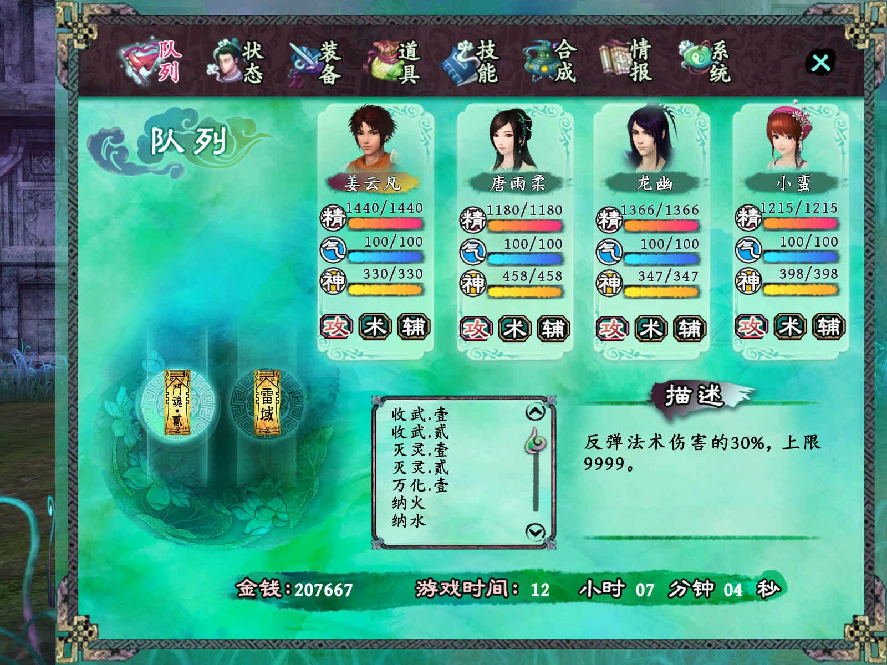
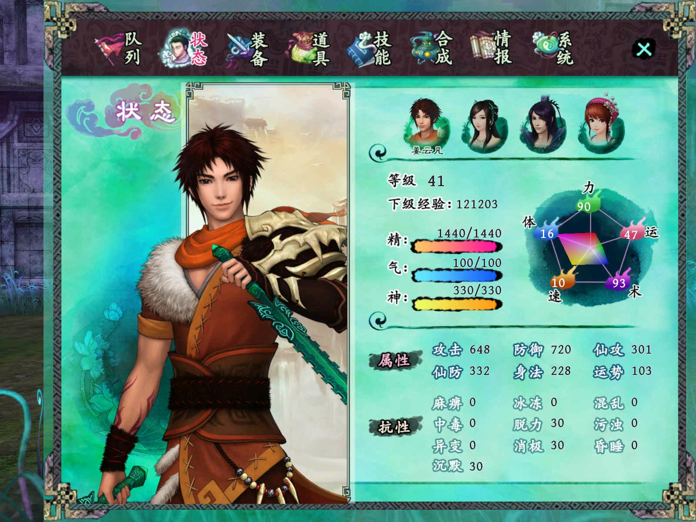

16:9 UI interface screenshots:
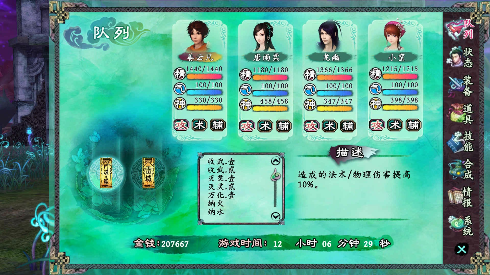
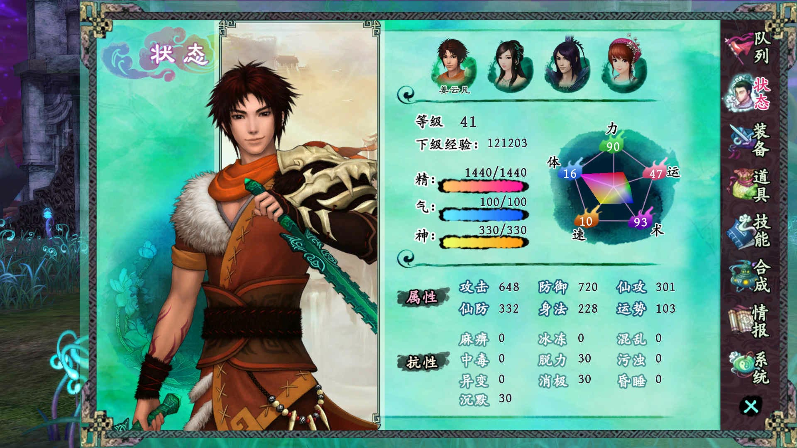

### Font Modification

The original font "Huakang Tangfeng Li" is not easy to read. I found bold-like fonts, and after selection, I think "Chill Kai" or "Xiawu Wenkai" are most suitable. You can also choose fonts already installed on the system or external fonts. Either way, you can choose your favorite font.
Some fonts are not supported. It is recommended to choose `.ttf` font files. If you find that text is not displayed or not fully displayed in the game, just replace it with another font.
Free font download: https://www.maoken.com/all-fonts-imgs

Chill Kai
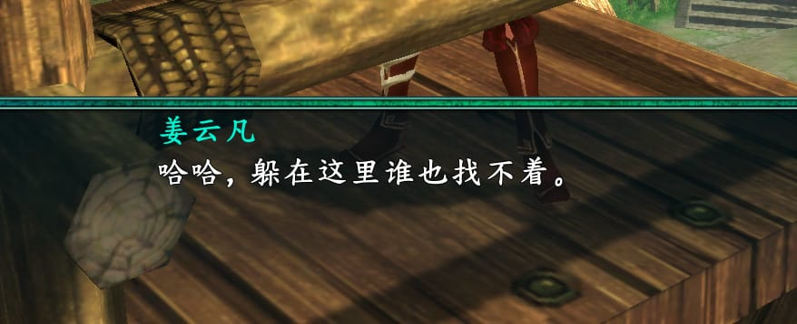

Xiawu Wenkai
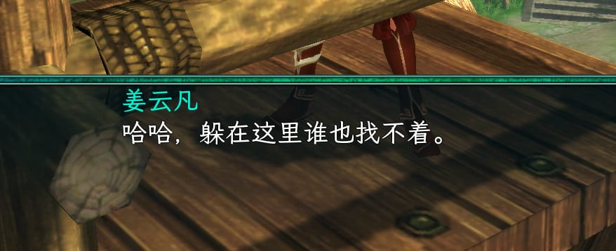

Huakang Tangfeng Li (Default font)


### Adjust Message Dialog Font Size

You can adjust the font size of the message dialog, mainly involving NPC dialogs, selection boxes, story message boxes, and save/load game/return interface/exit game prompt boxes. There are small/medium/large/extra-large options. If you encounter misalignment, you need to restart the game or try installing again.
Note: To apply this feature, you need to apply the **UI Interface Resolution Expansion** feature first before adjusting the message box font size, otherwise there will be conflicts.
At size 48, some text will be clipped. It is recommended to use size 28 or 38.

Small (Default, size 18)
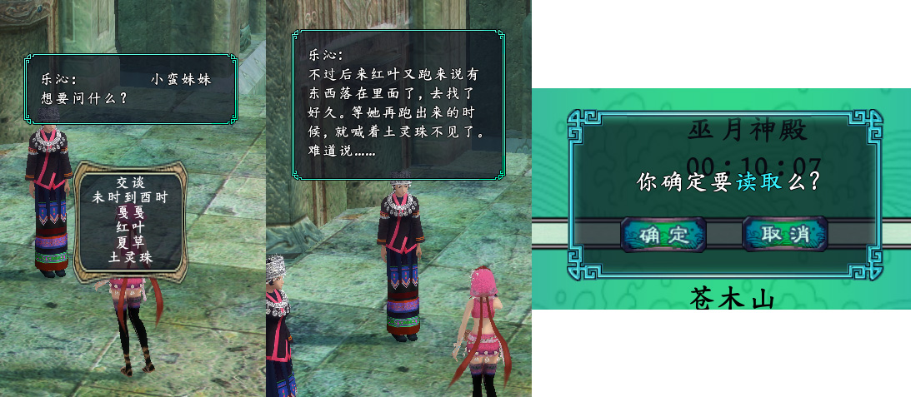

Medium (Recommended, size 28)
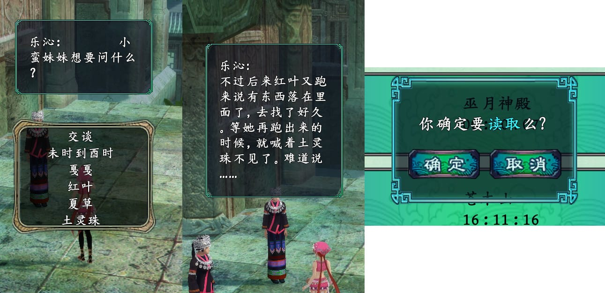

Large (size 38)
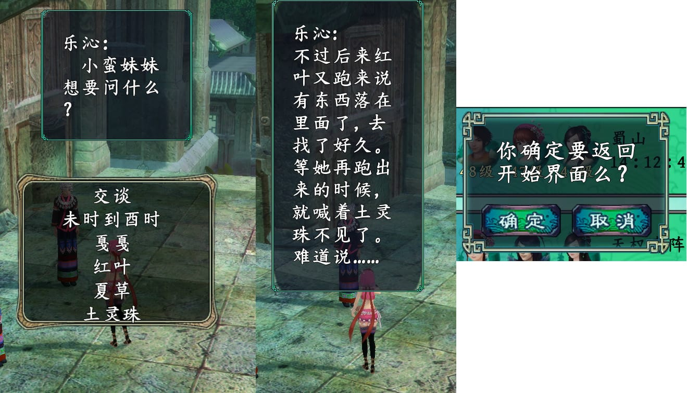

Extra Large (size 48)
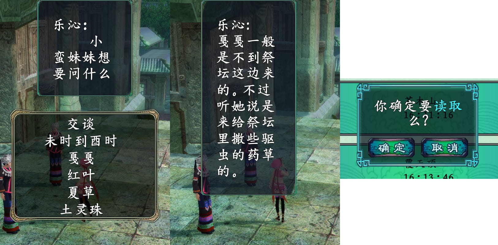

### Body Proportion Adjustment and Skin Whitening

This feature adjusts the model body proportions of the four main characters and whitens the skin tone.
It also applies to the appearance of the four main characters in the Sword and Fairy 5 prequel DLC "Dream Battle of Illusory World".

Original
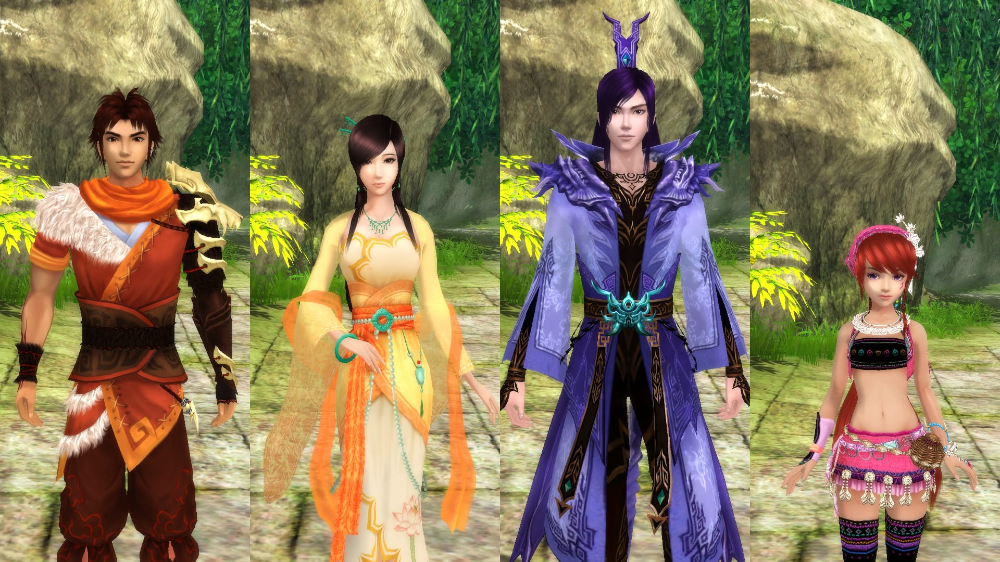

After adjustment
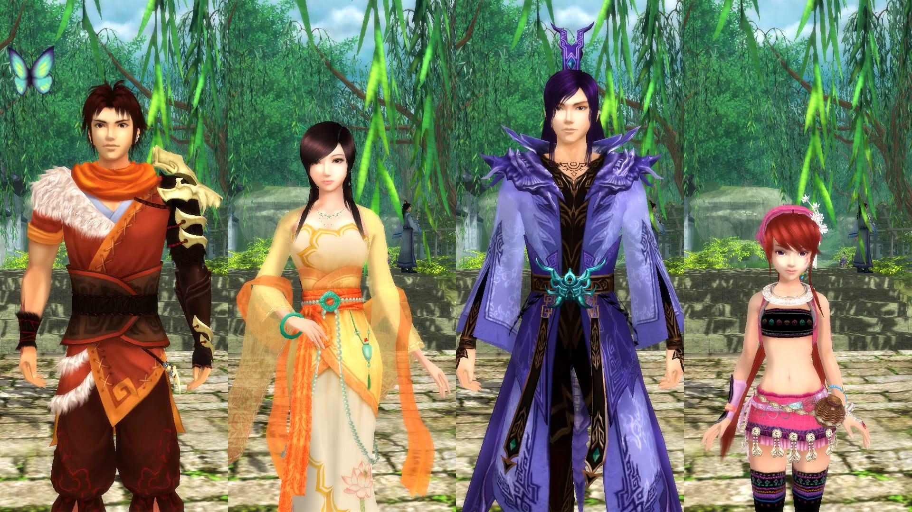

### Hide Battle UI Interface

Used to hide the battle UI interface for easier video recording. The following processing has been done: hide the battle victory interface (such as gaining experience, obtaining items, etc.); hide status names; hide damage numbers.

Original
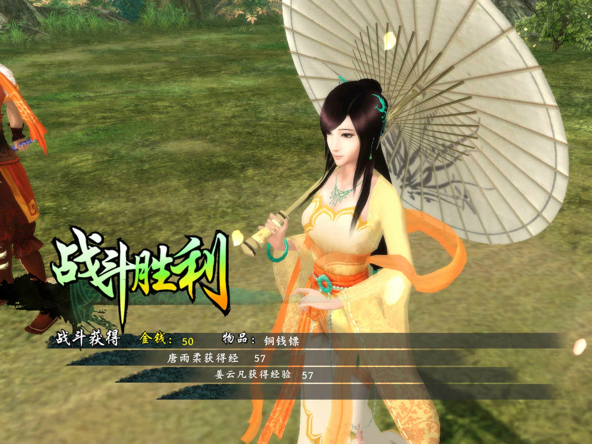

After hiding
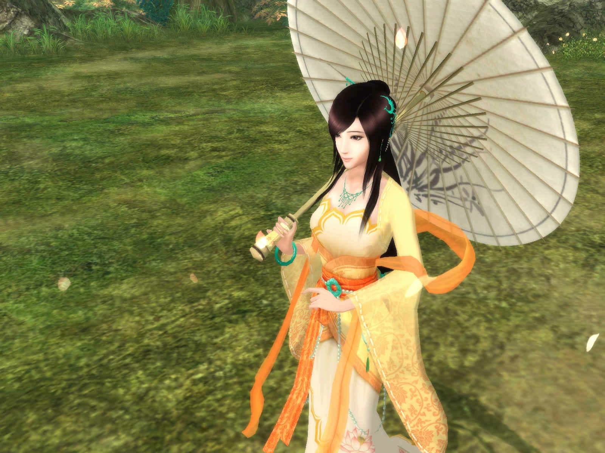
     
### Restore Initial Settings

Restore the game configuration to initial settings. If the previous features fail to apply, you can try to restore the initial settings.
     
 	 
## Reference MOD Patches/Tools

[Sword and Fairy 5 Retro Mod 1.06c](https://bbs.3dmgame.com/thread-2854641-1-1.html)  by:情姐姐
[uvlist modifier v2.0](https://tieba.baidu.com/p/3680752738?red_tag=3514355147) by:百度贴吧—风靡义磊

Thanks to the contributions of predecessors, I was able to integrate on this basis. Thank you!

## Special Thanks

AI code assistance: ChatGPT
Thanks to testers: 清风涧碎花弄影、水月澄明

## License

Using [CC BY-NC 4.0](LICENSE) license
